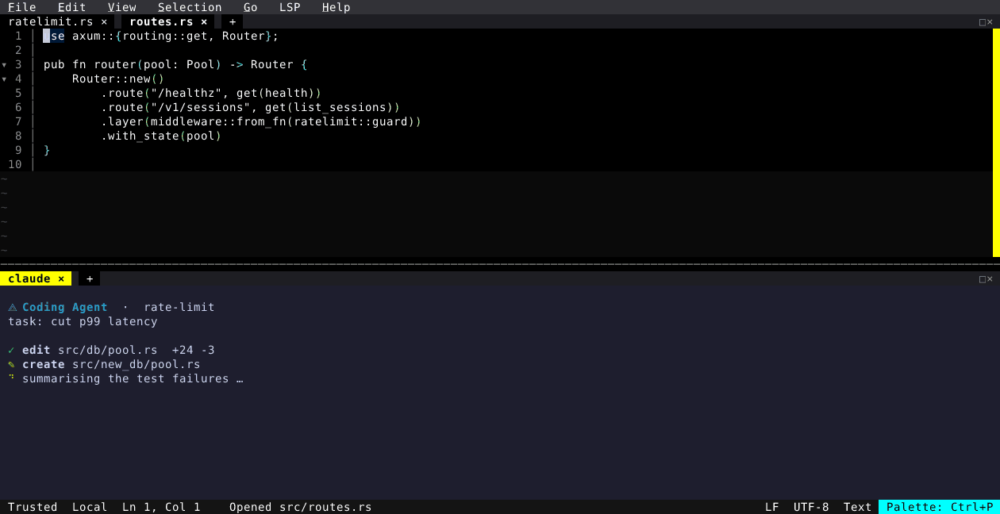

# One Editor, Every Worktree

Agentic coding turned a single-task editor into a multi-task problem. You cut a
worktree per task so the agents don't fight over one checkout, and then you're
juggling: one terminal multiplexer per worktree, one editor per worktree, and no
idea which agent is waiting on you.

The Orchestrator makes that one process. Every worktree is a **workspace** with
its own tabs, splits, terminals and scrollback, and the **dock** — a persistent,
non-modal left column — lists them all with branch, git summary and PR badge.
The arrow keys live-switch; nothing is torn down, and the agents in the
workspaces you're not looking at keep working.

  

The capture above is one repository checked out three times — `fix/auth-bypass`,
`perf/db-pool`, `feat/rate-limit` — plus `main` to review from. Each task
workspace has the files that task touches open as tabs, with its agent running
in a split beside the code. Walking down the dock and back up, every workspace
returns exactly as it was left, with its agent further along than when you
looked away.

## Getting there

- **`Run Agent…`** (`Ctrl+P`) launches `claude`, `codex`, `opencode`, `aider` or
  any command you like, in the current workspace or a brand-new one.
- **`New Workspace`** can cut the worktree for you: tick *Create a new git
  worktree*, name a new branch, and pick **Create & Visit** or **Create in
  Background** — the editor never blocks while it comes up.
- **`Orchestrator: Toggle Dock`** opens the dock; the Settings UI can open it
  automatically at startup, in card or compact layout.
- Agents that support resuming rejoin their conversation when you restart the
  editor, instead of starting over.

<!-- Generated by: cargo test --package fresh-editor --test all_tests blog_showcase_orchestrator_worktrees -- --ignored -->
<!-- Then run: scripts/frames-to-gif.sh docs/blog/orchestrator-worktrees -->
