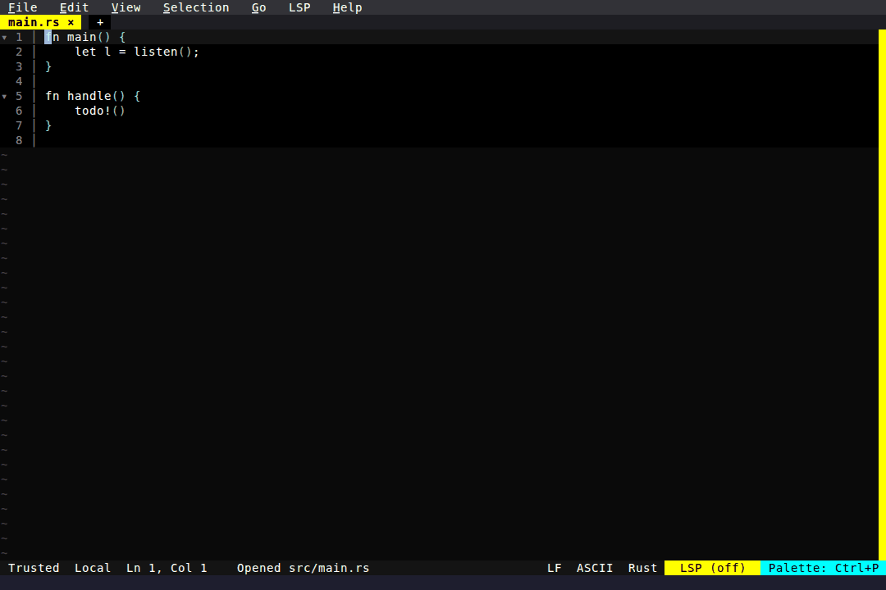

# Code Tours

A tour is a `.fresh-tour.json` manifest: an ordered list of steps, each one a
file, a line range, and some markdown explaining it. Load one and it opens as a
panel in the Utility Dock — beside the code rather than on top of it — with the
step's range highlighted in the editor above.

  

`n`/`p` step through it, `Enter` jumps to the code, `g` focuses the step rail,
and `q` closes the tour. The dock keeps its tab bar, so a tour stays open next
to Diagnostics or Search, several tours can be open at once, and one left open
comes back on the next launch.

A tour outlives the code it describes: when a step's file is gone the step still
reads, and only the jump is unavailable.

<!-- Generated by: cargo nextest run -p fresh-editor --test e2e_tests code_tour_showcase -- --ignored -->
<!-- Then run: scripts/frames-to-gif.sh docs/blog/productivity/code-tour --colors 64 --dither none -->
