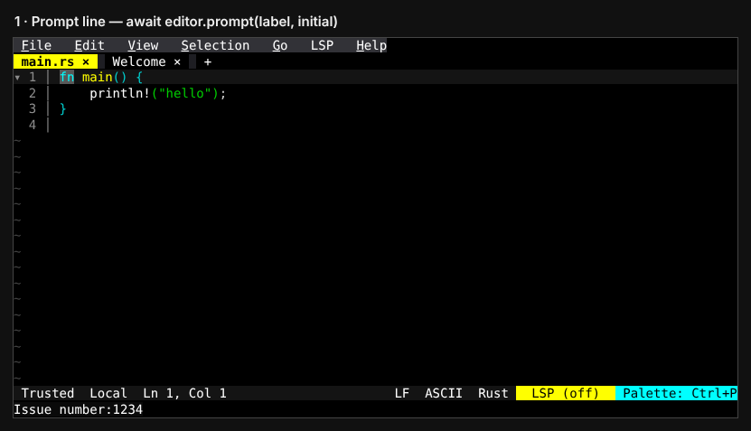
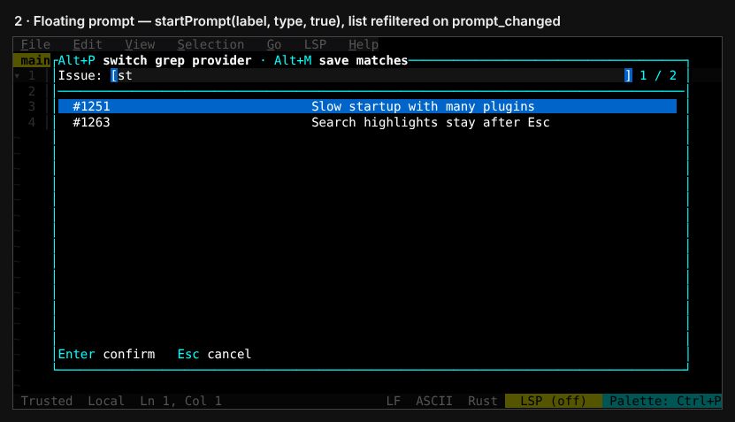
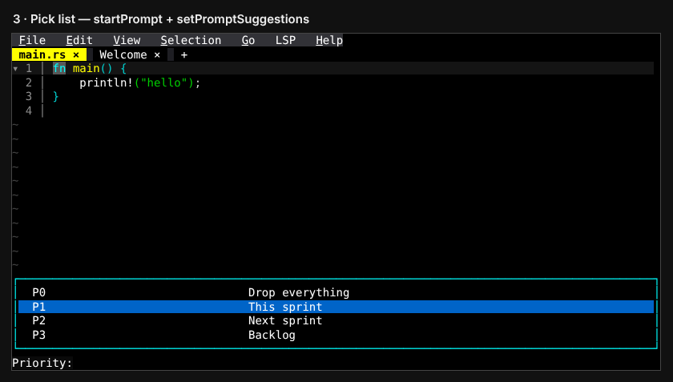
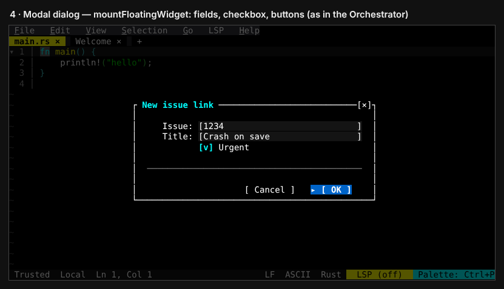
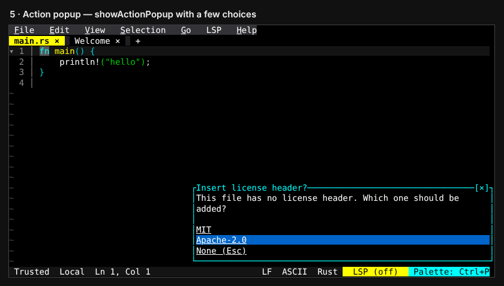
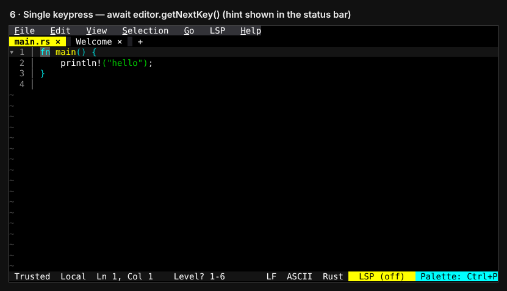
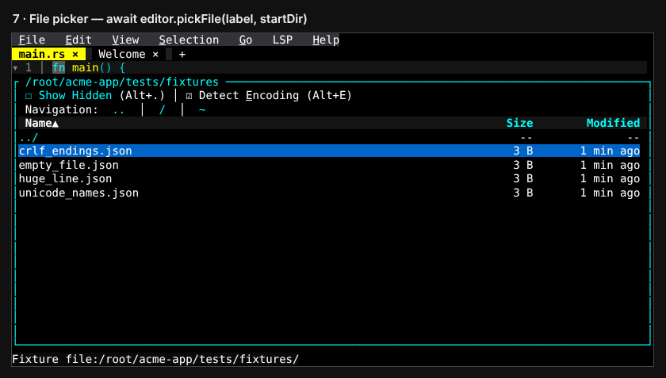

# Asking the user for input from a plugin

A plugin has seven ways to ask the user for input. Each example below is a
standalone file that registers one `Ask: …` command, asks, and reports the
answer in the status bar. Paste one into `~/.config/fresh/init.ts`
(Ctrl+P → `init: Edit init.ts`, then `init: Reload init.ts`), or drop it into a
plugin. Then run the command from the palette.

Tested with Fresh 0.5.2.

| # | Method | API | Use it for |
|---|--------|-----|------------|
| 1 | [Prompt line](#1-prompt-line) | `await editor.prompt()` | One value, with the least code |
| 2 | [Floating prompt](#2-floating-prompt) | `startPrompt(…, true)` + `prompt_changed` | Type to search, then pick or enter free text |
| 3 | [Pick list](#3-pick-list) | `startPrompt` + `setPromptSuggestions` | Choosing from a known set |
| 4 | [Modal dialog](#4-modal-dialog) | `mountFloatingWidget` + `widget_event` | Several fields at once, with buttons |
| 5 | [Action popup](#5-action-popup) | `showActionPopup` + `action_popup_result` | A short question with a few answers |
| 6 | [Single keypress](#6-single-keypress) | `await editor.getNextKey()` | One-key answers (1–9, y/n) |
| 7 | [File picker](#7-file-picker) | `await editor.pickFile()` | Choosing a file path |

## 1. Prompt line

[`1_prompt_line.ts`](https://github.com/sinelaw/fresh/blob/master/docs/plugins/examples/asking-for-input/1_prompt_line.ts)

```ts
const value = await editor.prompt("Issue number:", "");
if (value === null) return; // Esc
```



## 2. Floating prompt

[`2_floating_prompt.ts`](https://github.com/sinelaw/fresh/blob/master/docs/plugins/examples/asking-for-input/2_floating_prompt.ts)

This is the same prompt drawn as a centred card with a results pane, the way
Live Grep uses it. `prompt_changed` fires on every keystroke so the plugin can
refilter the list. The answer arrives in `prompt_confirmed`.



## 3. Pick list

[`3_pick_list.ts`](https://github.com/sinelaw/fresh/blob/master/docs/plugins/examples/asking-for-input/3_pick_list.ts)

The bottom prompt with suggestions. The chosen suggestion's `value` arrives as
`input` in `prompt_confirmed`.



## 4. Modal dialog

[`4_modal_dialog.ts`](https://github.com/sinelaw/fresh/blob/master/docs/plugins/examples/asking-for-input/4_modal_dialog.ts)

This is the machinery behind the Orchestrator's dialogs. A titled, closable
panel holds real controls: text fields, checkboxes, dropdowns and buttons. The
editor handles typing, focus and Tab. The plugin receives `widget_event`s
(`change`, `toggle`, `activate`, `cancel`) and calls `updateFloatingWidget` to
re-render after it changes state such as the checkbox. The bundled plugins
build the spec with helpers from `lib/widgets.ts`. A standalone `init.ts`
writes the spec out by hand.



## 5. Action popup

[`5_action_popup.ts`](https://github.com/sinelaw/fresh/blob/master/docs/plugins/examples/asking-for-input/5_action_popup.ts)

A titled message with a list of choices. The chosen `action_id` arrives in
`action_popup_result`.



## 6. Single keypress

[`6_single_key.ts`](https://github.com/sinelaw/fresh/blob/master/docs/plugins/examples/asking-for-input/6_single_key.ts)

No input UI at all. The plugin shows a hint (here in the status bar) and takes
the very next key, so the user doesn't need to press Enter. For loops that read
several keys, wrap them in `beginKeyCapture()` / `endKeyCapture()`.



## 7. File picker

[`7_file_picker.ts`](https://github.com/sinelaw/fresh/blob/master/docs/plugins/examples/asking-for-input/7_file_picker.ts)

Fresh's own Open File browser. It resolves with the chosen path, or `null`, and
opens nothing. The optional second argument sets the starting directory.


