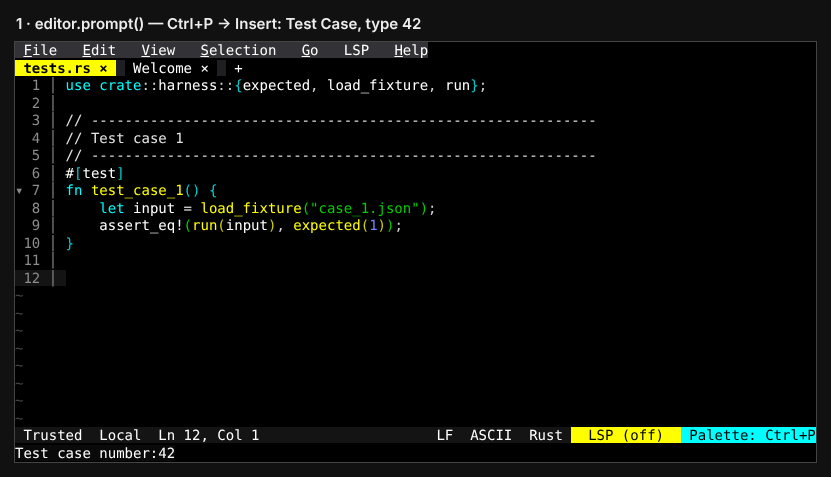
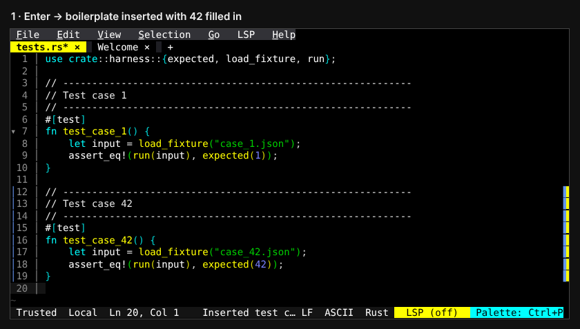
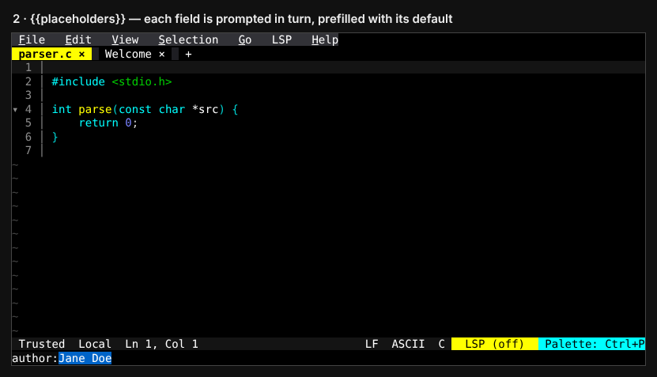
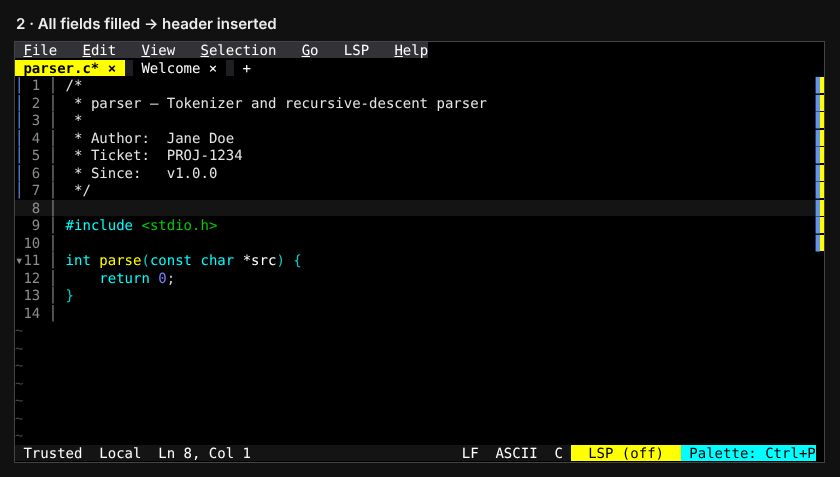
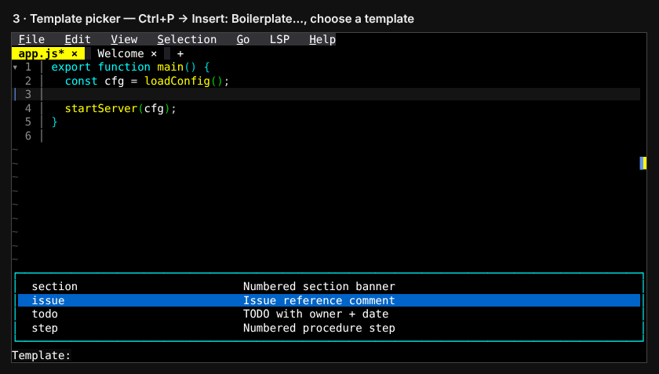
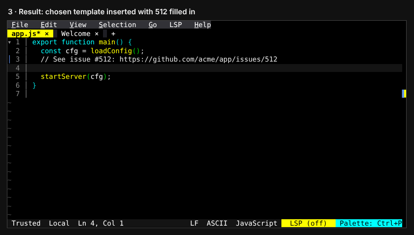
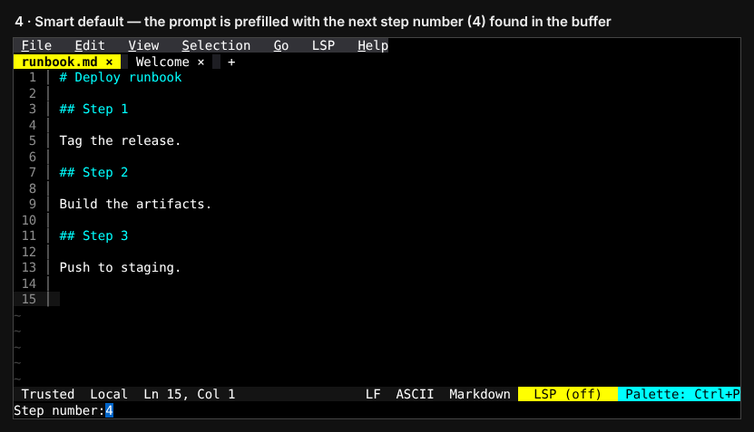
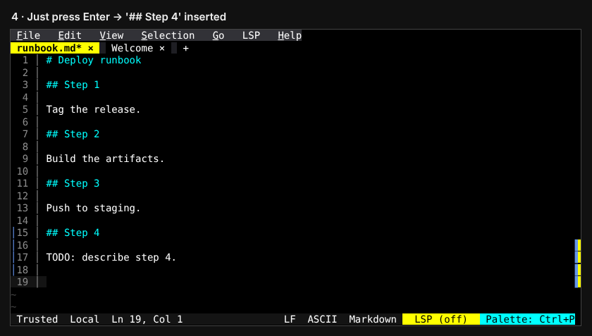
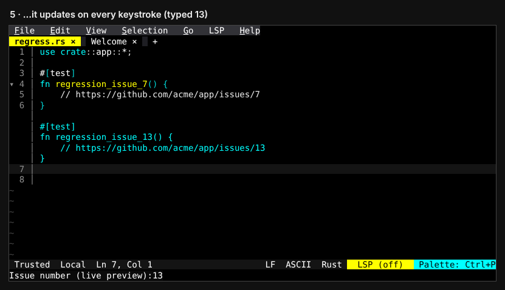
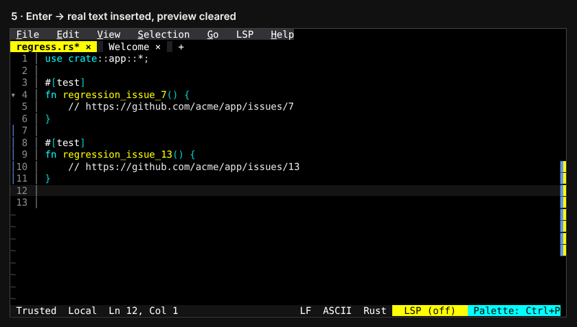

# Prompting for values before inserting boilerplate

Instead of inserting boilerplate and then hand-editing it, have the command
**ask for the values first** and build the text from them. Below are five ways
to do it, from simplest to fanciest. Each file stands alone. Paste one into
`~/.config/fresh/init.ts` (Ctrl+P → `init: Edit init.ts`, then
`init: Reload init.ts`), or drop it into a plugin. Then run the command from
the palette (Ctrl+P).

Tested with Fresh 0.5.2.

| # | File | Technique | Good for |
|---|------|-----------|----------|
| 1 | [`1_simple_prompt.ts`](https://github.com/sinelaw/fresh/blob/master/docs/plugins/examples/boilerplate-prompts/1_simple_prompt.ts) | `await editor.prompt()` + template string | One value (e.g. a number) |
| 2 | [`2_multi_field.ts`](https://github.com/sinelaw/fresh/blob/master/docs/plugins/examples/boilerplate-prompts/2_multi_field.ts) | Named placeholders, one prompt each | Several fields |
| 3 | [`3_template_picker.ts`](https://github.com/sinelaw/fresh/blob/master/docs/plugins/examples/boilerplate-prompts/3_template_picker.ts) | `startPrompt` + `setPromptSuggestions` + `prompt_confirmed` | Many templates behind one command |
| 4 | [`4_smart_default.ts`](https://github.com/sinelaw/fresh/blob/master/docs/plugins/examples/boilerplate-prompts/4_smart_default.ts) | Compute the default (next number, or the selection) | Sequences, where you usually just press Enter |
| 5 | [`5_live_preview.ts`](https://github.com/sinelaw/fresh/blob/master/docs/plugins/examples/boilerplate-prompts/5_live_preview.ts) | `prompt_changed` + `addVirtualLine` | Seeing the result while you type |

## 1. Simple: `editor.prompt()`

The core of it is three lines:

```ts
const n = await editor.prompt("Test case number:", "");
if (n === null) return;                       // Esc
editor.insertAtCursor(`fn test_case_${n}() { ... }`);
```




## 2. Several fields with placeholders

::: v-pre
Write the template once with `{{name}}` or `{{name:default}}`. The command asks
for each distinct name in order, with its default prefilled, and replaces every
occurrence.
:::




## 3. Template picker

One command (`Insert: Boilerplate…`) lists all your templates. Pick one, fill
in its fields, and it's inserted.




## 4. Smart default

The command scans the buffer for the last `## Step N` and prefills the prompt
with `N+1`, so most of the time you just press Enter. If text is selected, that
text becomes the default instead, and the selection is replaced.




## 5. Live preview

This uses the event-driven prompt API. On every keystroke (`prompt_changed`) the
would-be text is drawn as virtual lines at the cursor. They have no line
numbers and aren't in the buffer yet. Enter inserts the text for real, and Esc
clears the preview.



