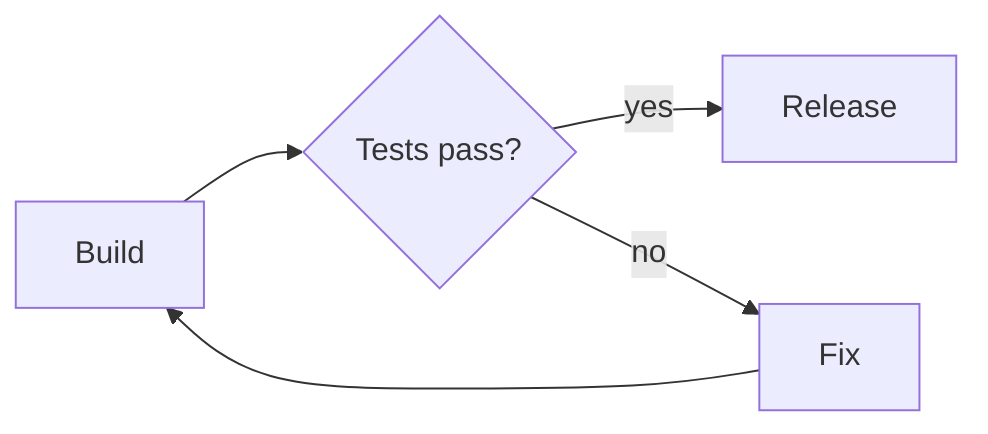

# Release notes

The fit uses $\sigma^2$ and $\mu_0$ from the last run.

$$f(x) = \frac{1}{\sigma\sqrt{2\pi}} e^{-\frac{(x-\mu)^2}{2\sigma^2}}$$

```mermaid
flowchart LR
    A[Build] --> B{Tests pass?}
    B -->|yes| C[Release]
    B -->|no| D[Fix]
    D --> A
```
